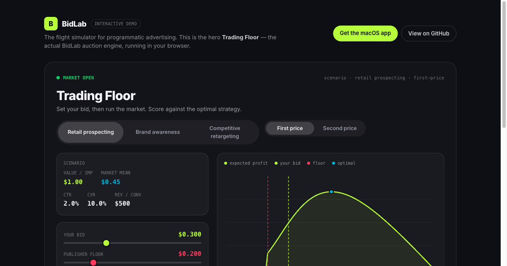
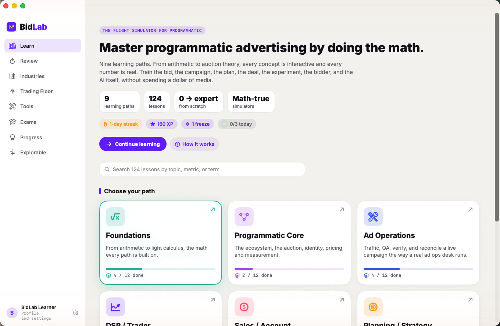
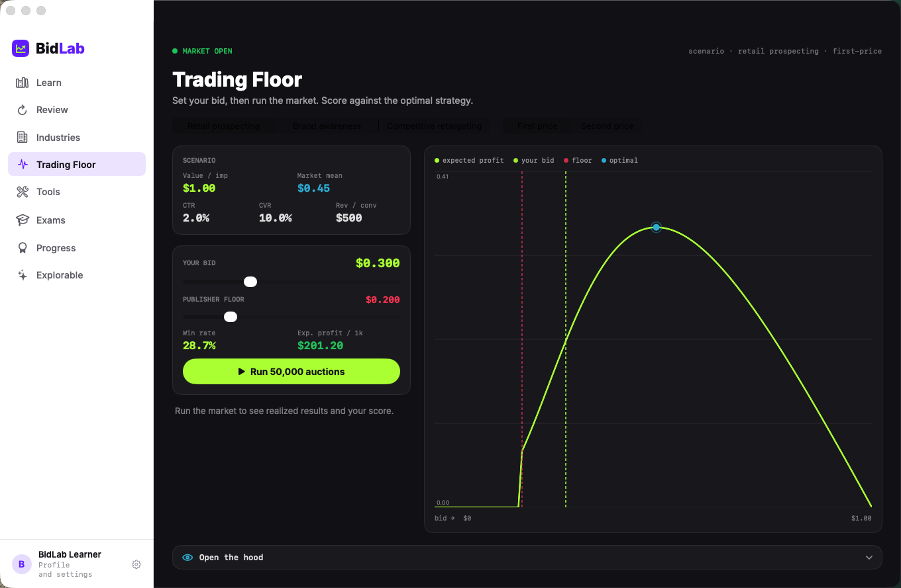
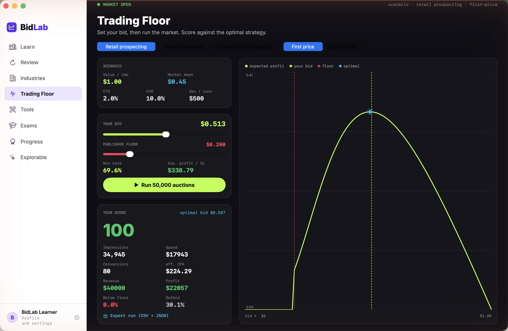
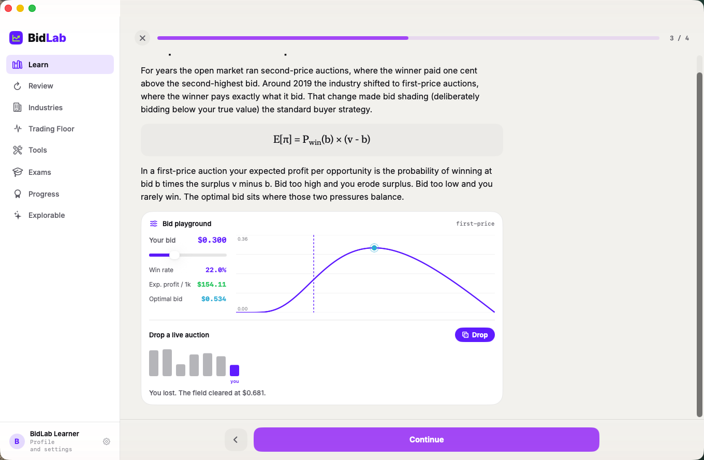
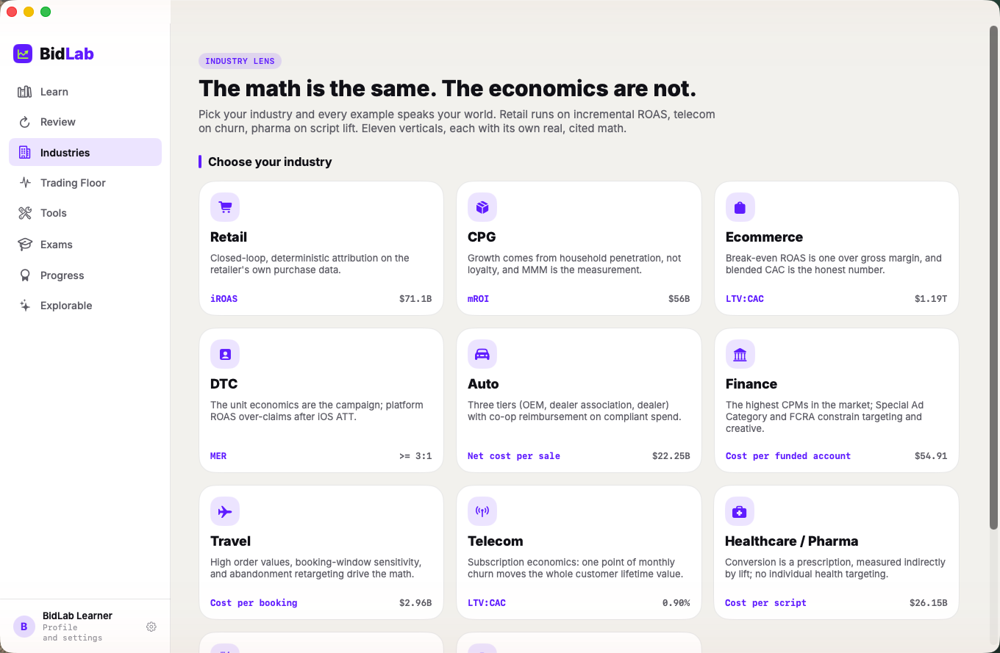
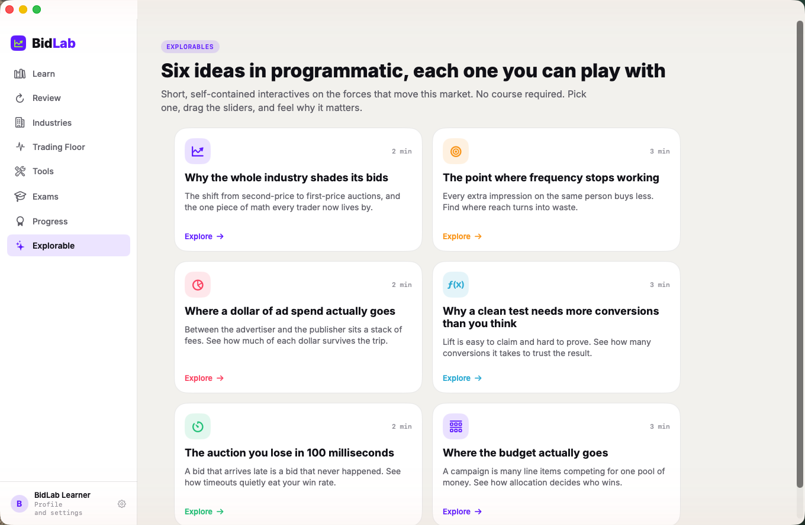
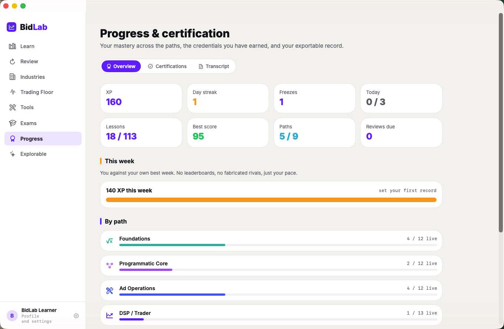

# BidLab

[](https://github.com/scumunna/BidLab/actions/workflows/ci.yml)

The flight simulator for programmatic advertising. A native macOS app that
teaches the math of programmatic by doing it: nine learning paths (Foundations
and Programmatic Core, plus Ad Operations, DSP/Trader, Sales, Planning,
Analytics, Engineering, and AI in AdTech), 124 interactive lessons, 9 role
certification exams, a math-true bidding simulator, and a shareable credential.

Every concept is interactive and every number is real. Train the bid, the plan,
the deal, the experiment, and the bidder itself, without spending a dollar of
media.

## Try it live (no install)

**▶ [Open the interactive web demo](https://scumunna.github.io/BidLab/)** — the
*actual* BidLab engine running in your browser, free and on any device: drag a
bid and run 50,000 auctions scored against the optimum, model reach and
frequency, and size an A/B test. No Mac required.

[](https://scumunna.github.io/BidLab/)

Prefer the full experience? **[Download for macOS](https://github.com/scumunna/BidLab/releases)**
— 124 lessons, exams, spaced-repetition review, and shareable credentials — or
build from source below.

> The web demo is a faithful TypeScript port of the pure `BidLabCore` Swift
> engine, verified bit-for-bit against it in a golden-master test (a given seed
> reproduces the native app's exact result).

## Screenshots

**Learn — nine role-based paths and 124 cited, interactive lessons**



**Trading Floor — a math-true bidding simulator with first and second-price auctions, a log-normal market, and publisher floors**



**Run 50,000 auctions in one click — realized win rate, spend, conversions, profit, the floor-vs-competition loss split, and your score against the optimal bid**



**Every concept is interactive — drag the bid and drop a live auction inside the lesson itself, and the math responds in real time**



**Industries — the same math across eleven verticals, each with its real economics**



**Explorable — a library of standalone, share-worthy interactive explainers**



**Progress and certification — an exportable transcript and shareable credentials**



## What is in here

- **`BidLabCore`** (built as a SwiftPM-style library): a pure, UI-free Swift
  engine validated by a known-answer test suite (2,500+ checks) covering pricing,
  auctions, probability, statistics, reach and frequency, budget allocation,
  pacing, a seeded market simulation, scoring, analytics (power, difference-in-
  differences, adstock, saturation, OLS), DSP systems (latency, queueing), and
  the lesson parser.
- **The app** (`Sources/BidLab`): a SwiftUI shell with nine surfaces (Learn,
  Review, Industries, Trading Floor, Tools, Exams, Progress, Explorable, and
  Settings), an original design system, interactive widgets, a native math
  renderer, the "open the hood" transparency panel, an embedded SQLite SQL lab,
  branded PNG/CSV/JSON export, and progress with a shareable certificate.
- **Content** (`Content/Lessons/*.md`): 124 authored, cited lessons in an original
  Markdown-flavored format, parsed at launch from the app bundle. See
  `Content/CONTENT_GUIDE.md` for the format.
- **Web demo** (`web/`): a Vite + React + TypeScript reimplementation of the hero
  explorables (Trading Floor, Reach & Frequency, A/B Power), deployed free to
  GitHub Pages. The math is a faithful port of `BidLabCore`, verified against the
  Swift engine in a golden-master test, and the build/deploy is automated in
  `.github/workflows/pages.yml`.

## Building and running

Requires macOS 14 or later and the Swift toolchain (Command Line Tools for
Xcode). This project builds entirely with `swiftc` (no full Xcode required),
because the Command Line Tools on the original machine shipped a broken SwiftPM.

```sh
./Scripts/test.sh      # build the core and run the test suite (2,500+ checks)
./Scripts/build.sh     # build the app -> build/BidLab.app
open build/BidLab.app  # run it
```

To produce a distributable disk image:

```sh
hdiutil create -volname BidLab -srcfolder build/BidLab.app -ov -format UDZO build/BidLab.dmg
```

### Toolchain notes

- Lessons are data, not code: edit any `Content/Lessons/{track}-{NN}.md` and
  rebuild. `Scripts/test.sh` validates every lesson file.
- `@State` is replaced by a one-line `@Local` `DynamicProperty` shim because the
  `SwiftUIMacros` plugin is absent from the Command Line Tools. Swap back to
  `@State` once a full Xcode toolchain is available.
- The app is ad-hoc signed. Code signing and notarization for public
  distribution require an Apple Developer ID.

## Status

BidLab 1.0. All nine paths are complete (124 lessons), every widget is
interactive, and the product has been verified running in the live environment.

## License

BidLab is released under the MIT License. See [LICENSE](LICENSE).

The bundled Inter typeface is licensed separately under the SIL Open Font
License; see `Resources/Fonts/Inter-LICENSE.txt`.
